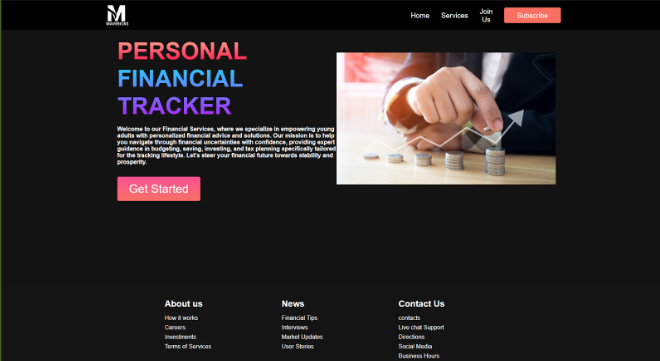
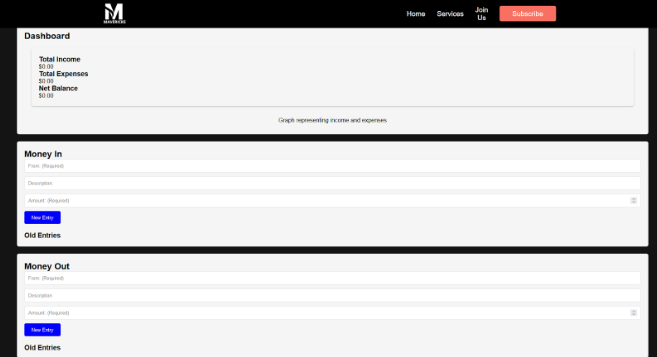

Team Name and Number:
	Mavericks
	Team Number 9

Description:
	Our application is a comprehensive personal financial education program integrated within its banking platform, aimed at helping younger generations become more financially literate by providing them with relevant articles, resources and tools required to make more informed financial decisions.
	Our application has a clean and minimalistic dark theme with images and light coloured text accentuated with a dark grey background, with a simple and easy navigation system to improve accessibility, helping shape the user experience.

Screenshot at the end of Sprint:

    
    

Point form description of completed, to be completed, and cancelled features:

Completed:
Expenses tracker Page
Create Financial Advice Page
Create Expense Page
Create Homepage
Create Login Page

To Do:
Financial Advice/Tips
Exporting Articles to the pages
Build an RSS Feed for the financial advice page

Backlog: 
Bill Reminder
Building a Database
Link pages to the database
Develop a front-end program for non subscribed users
Save visualisations in the database
Add a date section on the expense tracker page
Rework webpages to better dynamically fit smaller screens, and fix the disappearing navigation bar

Product Goal:
By April 2024, Mavericks aims to launch a comprehensive financial education program integrated within its banking platform, catering specifically to young adults. Mavericks' goal is to equip young adults with the knowledge and confidence to make informed financial decisions, ultimately contributing to our broader objective of becoming the preferred financial management solution for young adults. This initiative will provide resources, interactive tools, and educational content to enhance financial literacy and empowerment among this demographic.

Definition of Done:
In Mavericks Development Process, our product items are deemed to be complete when codes have been cleaned and when a pull request is inspected by another group member and approved. We also make sure the code follows our project standards as discussed in the proposal
The primary goal of increasing our user base and establishing user engagement is measurable through quantifiable increases in the user base, tracked through app usage metrics and market position.

	
